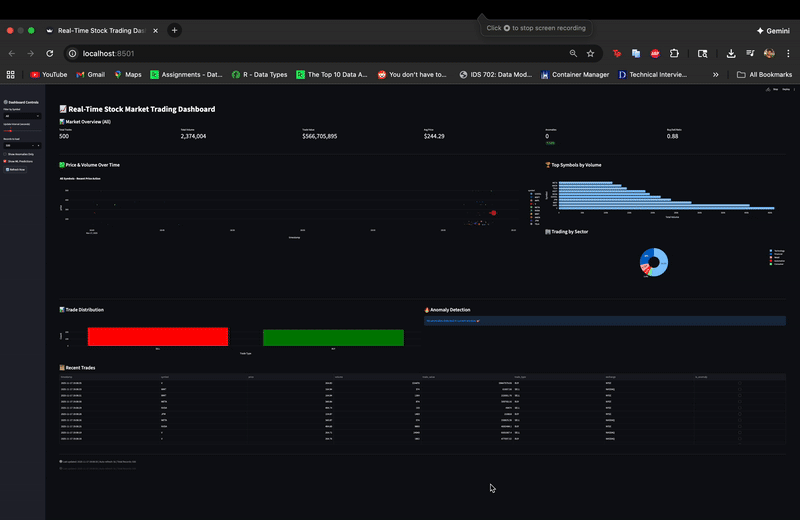

# Real-Time Stock Market Streaming Pipeline

[](https://www.python.org/downloads/)
[](https://kafka.apache.org/)
[](https://flink.apache.org/)
[](https://www.postgresql.org/)
[](https://streamlit.io/)

A production-grade real-time data streaming system that processes live stock market trades using Apache Kafka, performs advanced analytics with Apache Flink, detects anomalies with machine learning, and visualizes insights through an interactive Streamlit dashboard.

## Table of Contents

- [Features](#features)
- [System Architecture](#system-architecture)
- [Quick Start](#quick-start)
- [Dashboard](#dashboard)
- [Project Structure](#project-structure)

## Features

### Core Functionality
- ✅ **Realistic Stock Simulation**: Geometric Brownian Motion for authentic price movements
- ✅ **High-Throughput Streaming**: Apache Kafka with multi-partition architecture
- ✅ **Persistent Storage**: PostgreSQL with optimized schema
- ✅ **Live Dashboard**: Auto-refreshing Streamlit interface with 10+ visualizations
- ✅ **10 Stock Symbols**: Across Technology, Finance, Retail, and Automotive sectors

### Advanced Features (Bonus)
- 🚀 **Windowed Aggregations**: Real-time 1-minute tumbling window computations
- 🤖 **ML Anomaly Detection**: Statistical z-score based detection with real-time alerts
- 📊 **Technical Indicators**: SMA (Simple Moving Average), RSI (Relative Strength Index)
- 🎯 **Trend Prediction**: ML-powered directional forecasting with confidence scores
- 📈 **VWAP Calculation**: Volume-weighted average price for each symbol

## System Architecture

```
┌─────────────┐
│  Producer   │  Generates synthetic stock trades
│  (Python)   │  Using Geometric Brownian Motion
└──────┬──────┘
       │
       ▼
┌─────────────┐
│    Kafka    │  Message Broker
│  (3 parts)  │  Topic: stock_trades
└──────┬──────┘
       │
       ├──────────────────────┐
       ▼                      ▼
┌─────────────┐      ┌──────────────┐
│  Consumer   │      │    Flink     │  Real-time Aggregations
│  (Python)   │      │ (Stream Job) │  1-min Tumbling Windows
│             │      └──────┬───────┘
│ - Anomaly   │             │
│   Detection │             ▼
│ - DB Writer │      [trade_aggregations]
└──────┬──────┘
       │
       ▼
┌─────────────┐
│ PostgreSQL  │  Persistent Storage
│   Database  │  - trades table
└──────┬──────┘  - trade_aggregations table
       │
       ▼
┌─────────────┐
│  Streamlit  │  Interactive Dashboard
│  Dashboard  │  - Real-time KPIs
└─────────────┘  - Technical Analysis
                 - ML Predictions
```

## Quick Start

### Prerequisites

- **Docker & Docker Compose**: [Install Docker](https://docs.docker.com/get-docker/)
- **Python 3.8+**: [Install Python](https://www.python.org/downloads/)
- **8GB RAM** recommended
- **Available Ports**: 5432, 8081, 8501, 9092

### Installation

1. **Clone the repository**
   ```bash
   git clone https://github.com/Gechyb/Real-Time_Streaming_System_with_Apache_Kafka#
   cd Real-Time_Streaming_System_with_Apache_Kafka
   ```

2. **Install Python dependencies**
   ```bash
   pip install -r requirements.txt
   ```
   If the above does work try this 

   ```bash
   pip install kafka-python faker psycopg2-binary pandas plotly streamlit sqlalchemy numpy scikit-learn pyflink ta apache-flink
   ```

3. **Start Docker services**
   ```bash
   docker-compose up -d
   
   # Wait for services to initialize
   sleep 30
   
   # Verify all containers are running
   docker ps
   ```
   
   Expected containers: `kafka`, `postgres`, `flink-jobmanager`, `flink-taskmanager`

4. **Create Kafka topics**
   ```bash
   # Main trades topic
   docker exec -it kafka kafka-topics --create \
     --topic stock_trades \
     --bootstrap-server localhost:9092 \
     --partitions 3 \
     --replication-factor 1
   
   # Aggregations topic (for Flink)
   docker exec -it kafka kafka-topics --create \
     --topic trade_aggregations \
     --bootstrap-server localhost:9092 \
     --partitions 1 \
     --replication-factor 1
   
   # Verify
   docker exec -it kafka kafka-topics --list --bootstrap-server localhost:9092
   ```
### Running the Pipeline

Open **4 separate terminal windows** and run:

**Terminal 1 - Consumer** (Start first!)
```bash
python consumer.py
```

**Terminal 2 - Producer**
```bash
python producer.py
```

**Terminal 3 - Aggregator** (Windowed aggregations - bonus feature)
```bash
python flink_aggregator.py
```
*Note: This provides the same windowed aggregation functionality as Flink, but with simpler setup*

**Terminal 4 - Dashboard**
```bash
streamlit run dashboard.py
```

## Dashboard
🎉 **Dashboard will be available at**: `http://localhost:8501`




## 📂 Project Structure
```
Real-Time_Streaming_System_with_Apache_Kafka/
├── docker-compose.yml          # Infrastructure configuration
├── requirements.txt            # Python dependencies
├── producer.py                 # Stock trade generator
├── consumer.py                 # DB writer + anomaly detection
├── flink_processor.py          # Real-time aggregations
├── dashboard.py                # Streamlit dashboard
├── README.md                   
```


## Author

**Ogechukwu Ezenwa**
